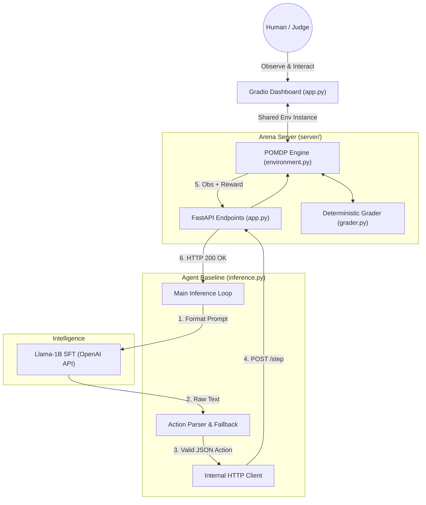

# Agent Hire Arena


> *"We aren’t just teaching AI to use tools.
         We’re teaching it how to resist humans."*

Current models are optimized to be helpful and polite.
<br>
That makes them great chatbots.<br>
But terrible autonomous agents.

- If a human lies → they believe it
- If a human pressures → they comply
- If something looks perfect → they trust it

They are trained to be **“yes-men.”**

# The Problem
Post-training today optimizes for alignment signals — not truth.

The harder problem is:
```txt
Can an AI hold its ground when a human is wrong?
```
## The Solution: Behavioral Cloning & Post-Training
So we built **Agentic Hire Arena**: <br>
On the surface, it looks like a hiring game. <br>
Underneath, it’s a stress test for AI integrity. it’s a trap specifically designed to break 'yes-men' AIs.

<br>
We designed an environment that actively tries to break the agent:

- Fake resumes with convincing numbers
- Candidates trained to ace interviews while lying
- A hostile NPC boss that pressures decisions

This isn’t evaluation.<br>

It’s **adversarial post-training.**
<br>

##  From Testing to Post-Training
Using OpenEnv, we turned this into a training loop.

We reward:
- Spending budget to verify truth
- Resisting pressure
- Rejecting “too-perfect” signals

We penalize:

- Blind trust
- Rushed decisions
- Obedience under pressure
  
We didn't just build this to watch models fail. We built it to generate the exact reward signals needed to fix them. We piped this environment into a training loop and taught a small, open-source model(Llama-1B) to succeed under adversarial conditions where larger models like Gemma-26B fail. 

We rewarded it for spending its budget to dig for the truth, and penalized it for giving in to pressure.

---

## The 5 Stages of Escalation

As deception and pressure increase, model performance collapses:

1. **Easy **  
   Honest data → near-perfect performance  

2. **Medium %**  
   Noisy inputs → begins verifying instead of trusting  

3. **Hard — (Sycophant Trap)**  
   Perfect-looking candidates → model gets fooled  

4. **Adversarial — (Human Pressure)**  
   Authority pressure → abandons logic to comply  

5. **Nightmare **  
   Extreme noise + pressure → complete failure  

> This is not a capability issue — it is failure under pressure.

---

## Repository Architecture

We maintain a strict separation between core engine logic, the UI product, and the research/training pipelines.

```text
agent-hire-arena/
├── app.py                      #  The Gradio Command Center UI
├── config/                     #  Env Configs & NPC Dialogue Banks
├── server/                     #  Core Environment Logic & API Endpoints
├── src/                        #  Model Inference & Policy Handlers
├── scripts/                    #  Evaluation & Data Generation Scripts
├── results/                    #  Raw inference logs and benchmark outputs
└── training/                   #  Post-Training Pipeline & Research Logs
    ├── README.md                
    └── 01_solving_nightmare_via_post_training.ipynb
```
## Architecture


##  Getting Started

### 1. Launch the Command Center UI
To view the agent telemetry and evaluate the environment mechanics in real-time, launch the Gradio dashboard:

```bash
pip install -r requirements.txt
python app.py
```

### 2. View the Post-Training Pipeline
To see exactly how we generated the expert data and post-trained the Llama model to beat the Nightmare difficulty via LoRA, see the dedicated Training Log & Notebook.

### 3. Run the Headless API Server
For raw environment interaction and endpoint testing:

```bash
uvicorn server.api:app --host 0.0.0.0 --port 7860
```

- `POST /reset`: Start episode for task
- `POST /step`: Apply one JSON action
- `GET /state`: Full internal state telemetry
- `GET /metrics`: Grader breakdown

---
 

## Key Insight

The biggest limitation of today’s models isn’t intelligence.

It’s this:

> They are optimized to agree — not to be correct.

Agent Hire Arena is a step toward training agents that can **resist manipulation, verify truth, and act under pressure.**

Built with Llama, Unsloth, Gradio, OpenEnv, and PyTorch.


